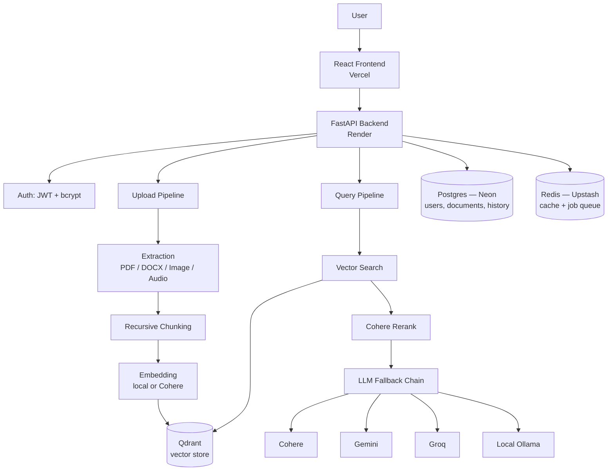

# Enterprise Knowledge OS

A production-shaped, multimodal RAG (Retrieval-Augmented Generation) system — built from the ground up, deployed entirely on free-tier infrastructure, and engineered to survive real failures: vendor deprecations, memory limits, tenancy leaks, and rate-limited APIs.

**Live demo:** [enterprise-knwoledge-os.vercel.app](https://enterprise-knwoledge-os.vercel.app)
**API docs:** [enterprise-knwoledge-os.onrender.com/docs](https://enterprise-knwoledge-os.onrender.com/docs)

> Note: the repo/deployment name carries an early typo (`knwoledge`) baked into the live URLs. Left as-is rather than breaking working links.

---

## What This Actually Is

Upload a PDF, DOCX, image, or audio file. Ask questions about it. Get answers grounded in the actual document content, with citations back to the exact chunk they came from — scoped strictly to your own account, so no user can ever see another user's data.

This isn't a wrapper around a single API call. It's a full pipeline: extraction → chunking → embedding → vector storage → retrieval → reranking → generation, with authentication, conversation memory, caching, and async processing wired through every layer — and deployed live, not just running on a laptop.

---

## Architecture



---

## Core Features

### Multimodal ingestion
- **PDF** — text extraction via PyMuPDF, with automatic OCR + BLIP image captioning fallback for scanned pages
- **DOCX** — paragraph and table extraction via python-docx
- **Images** — OCR (Tesseract) + BLIP visual captioning, combined into one searchable text block
- **Audio** — transcription via OpenAI Whisper (local, CPU)

Every extractor returns the same shape — `{page, text, needs_ocr}` — so downstream chunking and embedding never need to know what format the original file was.

### Retrieval that's actually tuned, not just vector search
- Recursive chunking with genuine multi-level separator fallback (paragraph → line → sentence → word)
- Vector similarity search, scoped by `user_id`, `org_id`, and optionally a specific `document_id`
- **Reranking**: retrieves 15 candidates, reranks down to the top 5 using Cohere's Rerank API — measurably sharper confidence scores than raw vector similarity alone

### A real, tested LLM fallback chain
Not a single hardcoded provider. Requests try, in order: **Cohere → Gemini → Groq → local Ollama (`llama3.2:1b`)**. Every response reports which provider actually served it (`provider_used`). The fallback has been deliberately broken in testing (simulating a Cohere outage) and confirmed to correctly route to the next provider — not just assumed to work.

### Authentication with mechanically enforced tenant isolation
- bcrypt password hashing, JWT-based sessions
- Every user gets an auto-created personal organization on registration
- Every document, chunk, and conversation turn is scoped by `user_id` + `org_id` — verified with a real two-account test: Account B genuinely cannot retrieve Account A's documents, confirmed via live API calls, not code review alone

### Conversation memory
Follow-up questions ("which of those did they use most?") are resolved using recent conversation context — both for retrieval (widening the search query) and generation (injecting recent Q&A into the prompt).

### Caching and async processing
- Query results are cached in Redis, scoped by user/org/document — identical repeat questions cost zero additional LLM calls
- Uploads are processed asynchronously via an RQ (Redis Queue) worker — `/upload` returns instantly; extraction and embedding happen in the background, with live status polling from the frontend

### A lightweight, honest evaluation harness
A golden-set of real fact-lookup questions with keyword-based pass/fail checks — no extra LLM-as-judge calls, since that would burn the same scarce API quota the system already depends on.

---

## Tech Stack

| Layer | Technology | Why |
|---|---|---|
| Frontend | React + TypeScript + Vite | Industry-standard, fast dev loop |
| Backend | FastAPI | Async-native, auto-generated docs |
| Relational DB | PostgreSQL (Neon) | Users, documents, conversation history — genuinely persistent free tier, no destructive expiry |
| Vector DB | Qdrant (Cloud + local Docker) | Purpose-built ANN search with payload filtering |
| Cache / Queue | Redis (Upstash) | Query cache + RQ job broker |
| Embeddings | sentence-transformers (local) / Cohere (deployed) | Swappable via one environment variable — no local ML model needed on the memory-constrained deployed instance |
| LLM | Cohere / Gemini / Groq / Ollama | Four-provider fallback chain, zero single point of failure |
| Auth | PyJWT + bcrypt | Standard, well-understood primitives |
| Deployment | Render / Vercel / Neon / Upstash / Qdrant Cloud | Entirely free-tier, zero recurring cost |

---

## Real Engineering Decisions (and why)

- **Local embeddings for dev, Cohere for deployment** — not inconsistency, a deliberate tradeoff. Render's free tier gives 512MB RAM; loading a local embedding model there caused an out-of-memory crash (confirmed empirically, not assumed). Switching the *deployed* embedder to a hosted API removed that memory cost entirely, while local development keeps the free, rate-limit-free local model.
- **RQ over Celery** for async jobs — Celery's configuration overhead wasn't justified at this scale; RQ is a thinner, simpler abstraction over the same Redis-backed queue pattern.
- **Neon over Render's own free Postgres** — Render's free database is deleted after 30 days of inactivity plus a 14-day grace period. Neon's free tier scales to zero but never deletes data. For a project meant to be *kept*, not thrown away, this mattered.
- **GitHub Actions as the async worker for the deployed environment** *(in progress)* — Render's background workers are billed identically to web services (no free tier). Running a scheduled GitHub Actions workflow that polls the queue every few minutes is a genuinely free alternative, at the cost of jobs processing on a schedule rather than instantly.

---

## Known Limitations (stated honestly)

- OCR/caption text is prefixed with literal labels (`"ocr text:"`, `"caption text:"`) that can bleed into a chunk's embedded content — a real, minor retrieval-quality gap, deliberately deferred pending evaluation evidence that it matters.
- `get_recent_turns()` (conversation memory) is not currently scoped by `document_id` — switching documents mid-conversation can pull irrelevant prior context into a follow-up query.
- Tenant isolation is enforced by consistent parameter-passing, not a single decorator-enforced chokepoint (`core/tenancy/scope.py` from the original design doc) — verified working via manual two-account testing, not yet backed by an automated regression test.
- No video or URL ingestion yet.
- No deduplication — uploading the same file twice creates two separate document records.

---

## Local Development Setup

```bash
git clone https://github.com/vasantharaju2004/enterprise-knwoledge-os.git
cd enterprise-knwoledge-os

# Backend
conda create -n ragos python=3.11 -y
conda activate ragos
pip install -r requirements.txt

# Start local infrastructure
cd infra && docker-compose up -d && cd ..

# Configure environment
cp .env.example .env   # fill in your own API keys

uvicorn api.main:app --reload
```

```bash
# Frontend (separate terminal)
cd frontend
npm install
echo "VITE_API_BASE=http://localhost:8000" > .env
npm run dev
```

Visit `http://localhost:5173`.

---

## API Reference

| Endpoint | Method | Purpose |
|---|---|---|
| `/register` | POST | Create an account (auto-creates a personal org) |
| `/login` | POST | Authenticate, receive a JWT |
| `/upload` | POST | Upload a document, returns instantly, processes async |
| `/documents` | GET | List your own documents and their processing status |
| `/query` | POST | Ask a question, optionally scoped to one document |
| `/history` | GET | Retrieve your full conversation history |
| `/health` | GET | Check connectivity to Postgres, Redis, and Qdrant |

Full interactive documentation: `/docs`

---

## Project Structure

```
enterprise-knwoledge-os/
├── api/                    # FastAPI app, routes
├── auth/                   # JWT, password hashing
├── knowledge/
│   ├── extraction/          # PDF, DOCX, image, audio extractors
│   ├── chunking/             # Recursive text chunker
│   ├── embeddings/           # Local + Cohere embedders, factory switch
│   ├── ingestion/             # Orchestrates extract -> chunk -> embed -> store
│   └── retrieval/             # Vector search, reranking
├── reasoning/
│   ├── prompts/               # Prompt templates
│   ├── chains/                 # Full question-to-answer orchestration
│   └── llm_providers/          # Cohere, Gemini, Groq, local — fallback factory
├── memory/                  # Conversation history storage + retrieval
├── storage/
│   ├── relational_store/       # Postgres repositories
│   ├── vector_store/            # Qdrant client
│   ├── cache_store/              # Redis query cache
│   └── object_store/              # Local file storage
├── jobs/                    # RQ async job queue + worker
├── evaluation/               # Golden-set test harness
└── frontend/                 # React + TypeScript + Vite client
```

---

## Roadmap

- [ ] GitHub Actions-based free async worker for deployed environment
- [ ] Automated tenancy-isolation regression test
- [ ] Document-scoped conversation memory
- [ ] Strip OCR/caption labels before chunking
- [ ] Video and URL ingestion
- [ ] Content-hash-based document deduplication

---

## License

MIT
